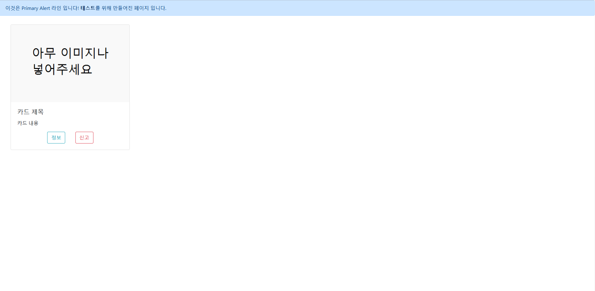

bootstrap CSS 프레임워크를 이용하여 해당 페이지를 구현해 볼것 (단, bootstrap은 4.0.0 버전을 사용할 것, 링크: `"https://cdn.jsdelivr.net/npm/bootstrap@4.0.0/dist/css/bootstrap.min.css"`

굉장히 어려울 것 같긴한데…. 맨 위에는 Primary Alert, 카드는 margin left 2vw margin top 3vh 카드의 크기는 20vw (반응형 웹에 대해서 공부하다 보면 알게 될것)

카드 밑 버튼은 왼쪽부터 순서대로 Info, Dnager 타입

풀이는 아래쪽에 코드로 적어서 올려주세용

참고하셔도 좋습니다. bootstrap이란 무엇인지, 어떻게 사용하는지 등등만 알아주세요.

[Get started with Bootstrap](https://getbootstrap.com/docs/5.3/getting-started/introduction/)
