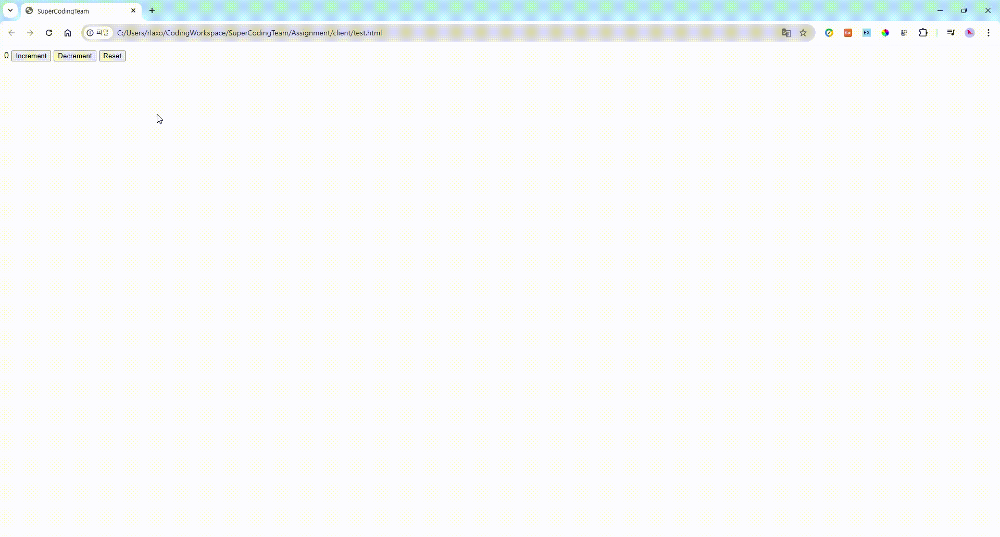

위 영상을 참고하여 아래 코드를 완성할 것

```html
<!DOCTYPE html>
<html lang="en">
  <head>
    <meta charset="UTF-8" />
    <meta name="viewport" content="width=device-width, initial-scale=1.0" />
    <title>SuperCodingTeam</title>
    <style>
      .number {
        display: inline-block;
      }
      @keyframes □ {
        0% {
          transform: scale(1);
        }
        50% {
          transform: scale(1.5);
        }
        100% {
          transform: scale(1);
        }
      }
      @keyframes □ {
        0% {
          transform: scale(1);
        }
        50% {
          transform: scale(0.5);
        }
        100% {
          transform: scale(1);
        }
      }
      @keyframes □ {
        0% {
          color: black;
        }
        50% {
          color: transparent;
        }
        100% {
          color: black;
        }
      }

      .increase {
        animation: increase 0.3s;
      }
      .decrease {
        animation: decrease 0.3s;
      }
      .reset {
        animation: reset 1s;
      }
    </style>
  </head>
  <body>
    <span id="number" class="number">0</span>
    <button id="increment">Increment</button>
    <button id="decrement">Decrement</button>
    <button id="reset">Reset</button>
  </body>
  <script>
    const number = document.getElementById("number");
    const increment = document.getElementById("increment");
    const decrement = document.getElementById("decrement");

    increment.addEventListener("click", () => {
      number.innerText = □;
      number.classList.add("increase");
      setTimeout(() => {
        number.classList.remove("increase");
      }, 300);
    });

    □

    reset.addEventListener("click", () => {
      number.classList.add("reset");
      setTimeout(() => {
        number.innerText = 0;
      }, 500);
      setTimeout(() => {
        number.classList.remove("reset");
      }, 1000);
    });
  </script>
</html>
```
